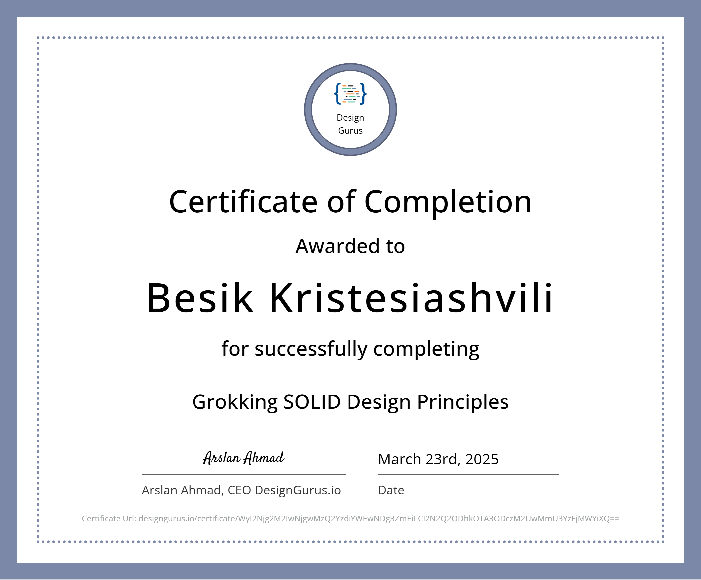
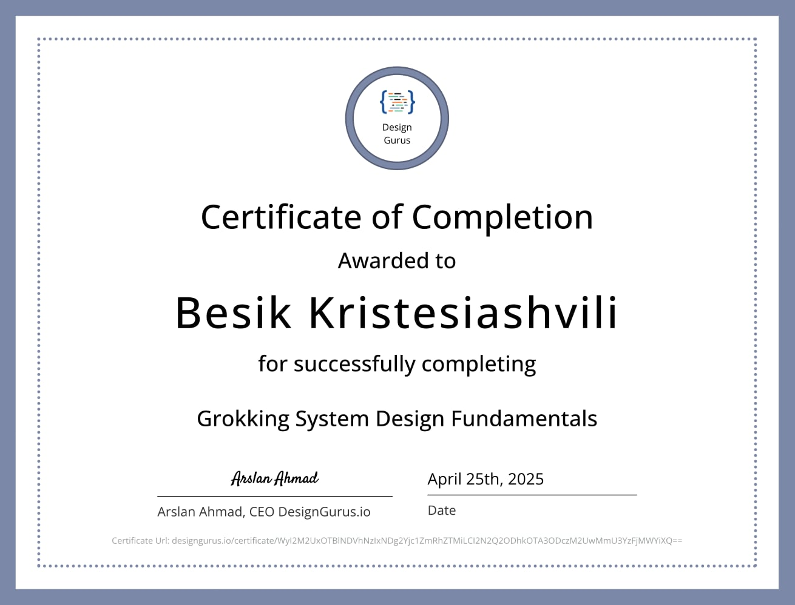

<!-- Header -->

  

  

  
  
  
  

---

### 🛠️ Tech Stack

  

### 📊 GitHub Stats

<table align="center">
  <tr>
    <td></td>
    <td></td>
  </tr>
  <tr>
    <td colspan="2" align="center"></td>
  </tr>
</table>

### 🌌 Contributions

  <picture>
    <source media="(prefers-color-scheme: dark)" srcset="https://raw.githubusercontent.com/bkristesiashvili/bkristesiashvili/output/profile-3d-contrib/profile-night-rainbow.svg" />
    <source media="(prefers-color-scheme: light)" srcset="https://raw.githubusercontent.com/bkristesiashvili/bkristesiashvili/output/profile-3d-contrib/profile-green-animate.svg" />
    
  </picture>

  <picture>
    <source media="(prefers-color-scheme: dark)" srcset="https://raw.githubusercontent.com/bkristesiashvili/bkristesiashvili/output/profile/snake-dark.svg" />
    <source media="(prefers-color-scheme: light)" srcset="https://raw.githubusercontent.com/bkristesiashvili/bkristesiashvili/output/profile/snake-light.svg" />
    
  </picture>

### 🏆 Trophies

  

### 🎓 Certifications

  
  
  
  
  

<!-- Footer -->

  

